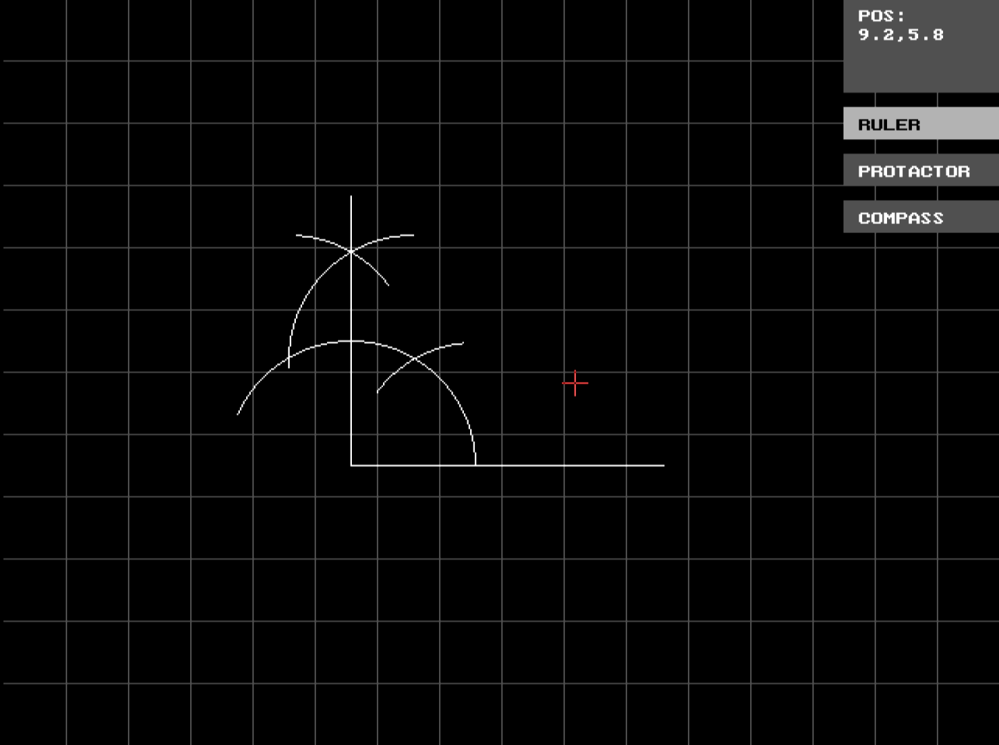

# Graphing Tools in C

A basic implementation of graphing tools in C.

## Usage
* Download the latest release from [here](https://github.com/sounak-kun/graph-c/releases)
* Copy that to your TurboC++ directory (Usually `C:\TURBOC3\`)
* Open TurboC++ (Recommended v3.0+)
* File > DOS shell
* Navigate to `C:\TURBOC3` (Usually via `cd ..`)
* Run `GRAPH.EXE`

## Build
* Create a new folder in the `PROJECTS` folder of your TurboC++ installation
* Clone the repo inside that folder
* Open TurboC++
* Project > Open Project
* Navigate to the folder you created and enter a new name for your project (like `GRAPH.PRJ`)
* Open the Projects window if it's not open automatically (Window > Project)
* Press <kbd>Insert</kbd> and add all the `*.C` files in the project.
* Press <kbd>Ctrl</kbd> + <kbd>F9</kbd> to compile and run
